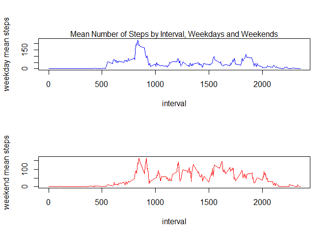

```r
knitr::opts_chunk$set(echo = TRUE)
library(ggplot2)
```

```
## Warning: package 'ggplot2' was built under R version 4.0.3
```

```r
library(dplyr)
```

```
## 
## Attaching package: 'dplyr'
```

```
## The following objects are masked from 'package:stats':
## 
##     filter, lag
```

```
## The following objects are masked from 'package:base':
## 
##     intersect, setdiff, setequal, union
```

## Loading and preprocessing the data
Download the data


```r
urlzip<-"https://d396qusza40orc.cloudfront.net/repdata%2Fdata%2Factivity.zip"
download.file(urlzip, destfile = "./activitymonitoringdata.zip")
unzip("./activitymonitoringdata.zip", exdir = "./data")
```

Load data


```r
activity<-read.csv(file = "./data/activity.csv")
```

Process data


```r
activity$date<-as.Date(activity$date, "%Y-%m-%d")
```

## What is mean total number of steps taken per day?
Calculate total number of steps taken per day


```r
steps<-with(activity, tapply(steps, date, sum))
date<-as.Date(names(steps), "%Y-%m-%d")
stepsperday<-data.frame(date,steps)
head(stepsperday)
```

```
##                  date steps
## 2012-10-01 2012-10-01    NA
## 2012-10-02 2012-10-02   126
## 2012-10-03 2012-10-03 11352
## 2012-10-04 2012-10-04 12116
## 2012-10-05 2012-10-05 13294
## 2012-10-06 2012-10-06 15420
```

Make a histogram of total number of steps taken each day


```r
ggplot(stepsperday, aes(steps)) + 
        geom_histogram(binwidth = 1000, fill = "blue") + 
        labs(title = "Total Number of Steps per Day") +
        labs(x="Steps", y="Frequency")
```

```
## Warning: Removed 8 rows containing non-finite values (stat_bin).
```

<!-- -->

Calculate mean and median of total number of steps taken per day


```r
stepsmean<-mean(steps, na.rm = TRUE)
stepsmedian<-median(steps, na.rm = TRUE)

stepsmean
```

```
## [1] 10766.19
```

```r
stepsmedian
```

```
## [1] 10765
```

## What is the average daily activity pattern?
Make a time series plot of 5-minute intervals and average steps per day


```r
intervalmeans<-with(activity, tapply(steps, interval, mean, na.rm = TRUE))
interval<-as.integer(names(intervalmeans))
stepsbyinterval<-data.frame(interval,intervalmeans)
ggplot(stepsbyinterval, aes(interval, intervalmeans))+
        geom_line(color = "blue")+
        labs(title = "Average Daily Steps by Interval")+
        labs(x="Interval", y="Mean Steps per Day")
```

<!-- -->

Find the interval which, on average, has the maximum number of steps


```r
interval[which.max(intervalmeans)]
```

```
## [1] 835
```
## Imputing missing values
Calculate the total number of rows with NA values


```r
sum(is.na(activity$steps))
```

```
## [1] 2304
```

Fill the missing data in with mean steps value


```r
activitymod<-data.frame(activity, intervalmeans)
```

```
## Warning in data.frame(activity, intervalmeans): row names were found from a
## short variable and have been discarded
```

```r
activitymod<-activitymod %>% mutate(steps = ifelse(is.na(steps), intervalmeans, steps))
```

Make a histogram of total steps per day with the imputed data


```r
stepsmod<-with(activitymod, tapply(steps, date, sum))
stepsperdaymod<-data.frame(date,stepsmod)
ggplot(stepsperdaymod, aes(stepsmod)) + 
          geom_histogram(binwidth = 1000, fill = "blue") + 
          labs(title = "Total Number of Steps per Day") +
          labs(x="Steps", y="Frequency")
```

<!-- -->

Calculate the mean and median of total steps taken per day with imputed data


```r
stepsmeanmod<-mean(stepsmod)
stepsmedianmod<-median(stepsmod)

stepsmeanmod
```

```
## [1] 10766.19
```

```r
stepsmedianmod
```

```
## [1] 10766.19
```

## Are there differences in activity patterns between weedkays and weekends?
Create a factor variable indicating if a date is on a weekday or weekend


```r
dayofweek<-weekdays(activitymod$date)
dayofweek[grepl("Monday|Tuesday|Wednesday|Thursday|Friday",dayofweek)]<-"weekday"
dayofweek[grepl("Saturday|Sunday",dayofweek)]<-"weekend"
activitymod<-activitymod %>% mutate(daytype = factor(dayofweek))
```

Make a plot of average number of steps taken vs interval, based on type of day


```r
intervalmeans2<-with(activitymod, tapply(steps, list(interval, daytype), mean))
stepsbyinterval2<-data.frame(interval, intervalmeans2)
par(mfrow=c(2,1))
with(stepsbyinterval2, {
        plot(interval, weekday, 
             ylab = "weekday mean steps",
             type = "l",
             col = "blue")
        mtext("Mean Number of Steps by Interval, Weekdays and Weekends")
        plot(interval, weekend,
             ylab = "weekend mean steps",
             type = "l",
             col = "red")
        })
```

<!-- -->
